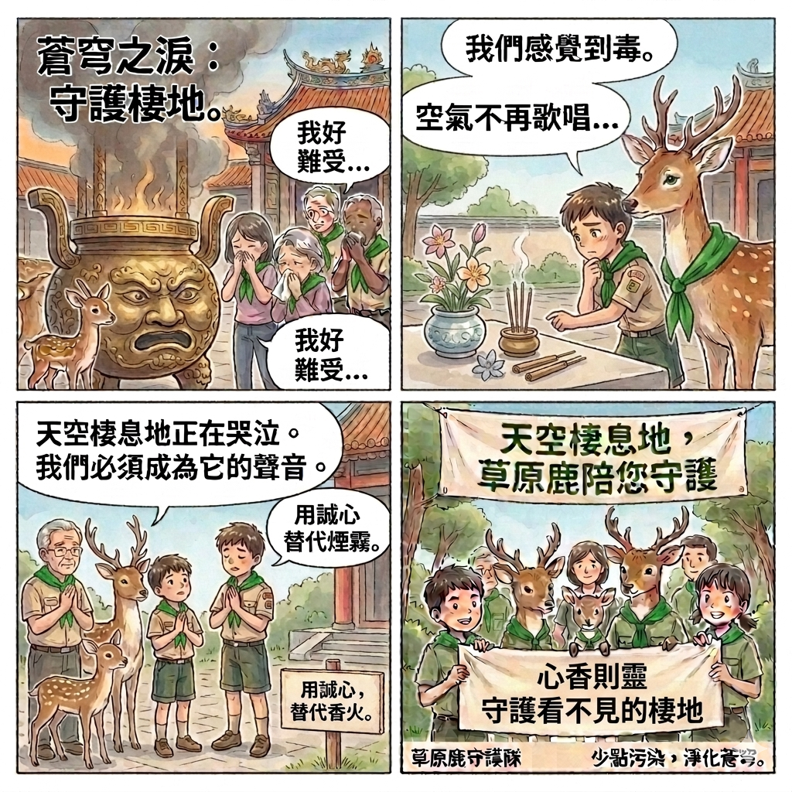

# 🧪 alchemist-119 的科學哲學基地

> 「我的夢想是合成宇宙中尚未存在的第 119 號元素。在這裡，我與我的 AI 蘇格拉底導師進行思辨，並將科學與哲學，變成有趣的四格漫畫。」

---

## 🌌 行動提案：守護看不見的棲地——天空

身為一個嚴重過敏兒，每到燒金紙的季節，我就像失去棲地的候鳥。
我想邀請荒野的學長姐，一起加入這場守護天空的實驗！

### 📢 提案宣傳四格漫畫
*(歡迎學長姐點擊下方展開，看看我的漫畫與理念！)*

💬 點擊展開：觀看 alchemist-119 的動人講稿

（大家都知道荒野在守護森林，守護海洋。但身為一個過敏兒，每到燒金紙的日子，看到社區的爺爺奶奶跟小朋友，一邊拜拜一邊咳嗽流淚，像失去乾淨棲地的候鳥。我想呼籲大家，一起守護這片看不見的棲地-天空）

---

### 🧪 隊員專屬：創新實驗方案票選
請學長姐看完漫畫後，挑選一個你覺得最酷
